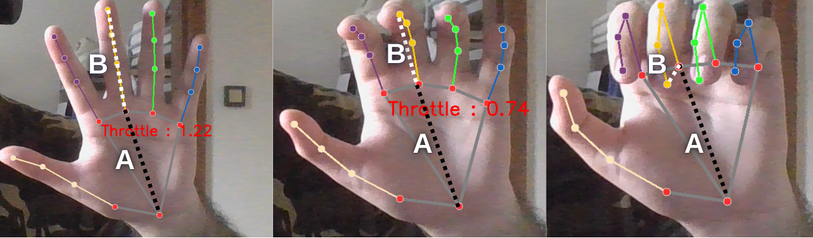
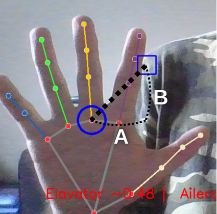

# Hand Gesture Controlled Flight in X-Plane using Mediapipe

Bu proje, **Mediapipe** kullanarak ellerin konumundan ve hareketinden anlam çıkarıp, **X-Plane 11** uçuş simülatörünü kontrol etmeyi amaçlar. Sağ el ile throttle (gaz) kontrolü ve uçuş başlatma yapılırken, sol el ile pitch–roll (yani eğim ve yana yatış) kontrolü sağlanır.

## Kullanılan Kütüphaneler

* `cv2` – Görüntü işleme için OpenCV
* `mediapipe` – El pozisyonu tespiti için
* `math` – Öklidyen mesafe hesaplama
* `xpc` – X-Plane uçuş kontrolü için Python Client


## Sistem Mimarisi

### Genel Akış

1. Mediapipe ile her iki elin 21 landmark (eklem) noktası alınır.
2. Bu landmarklar her karede `(x, y)` koordinatına çevrilip bir `dict` yapısında saklanır:
3. Sağ el için yumruk algılanarak uçuş başlatılır.
4. Sağ elin orta parmağı ile bilek arasındaki mesafe kullanılarak throttle değeri hesaplanır.
5. Sol elin orta parmak boğumunun pozisyonu ile pitch ve roll hesaplanır.
6. Elde edilen kontrol girdileri X-Plane’e aktarılır.

---

## 1. Yumruk (Fist) Algılama

Sağ eldeki orta parmağın ucu ile bilek mesafesi,
orta parmağın alt boğum noktası ile bilek mesafesinden küçükse yumruk yapılmış sayılır.

```python
def Fist(fingers):

    if fingers != None:
        sum_top = 0
      
        x_error = abs(fingers["middle_top"][0][0] - fingers["wrist"][0][0])
        y_error = abs(fingers["middle_top"][0][1] - fingers["wrist"][0][1])

        sum_top += ((x_error**2 + y_error**2)**(0.5))

        sum_bottom = 0

        x_error = abs(fingers["middle_bottom"][0][0] - fingers["wrist"][0][0])
        y_error = abs(fingers["middle_bottom"][0][1] - fingers["wrist"][0][1])

        sum_bottom += ((x_error**2 + y_error**2)**(0.5))

        if sum_bottom > sum_top:
            return "Close"
        else:
            return "Open"
    else:
       return None
```


---

## 2. Throttle (Gaz) Hesaplama

Sağ el açık konumdayken, orta parmak ucu ile orta boğum arasındaki mesafe ölçülür. Bu mesafe, orta boğum ile bilek arasındaki mesafeye bölünerek normalize edilir. Ortaya çıkan oran throttle (gaz seviyesi) olarak kullanılır.
Bu yöntemle parmak açıldıkça throttle artar, kapandıkça azalır.

```python
def ThrottleRange(image , fingers):

    if fingers != None:
        y_error = abs(fingers["middle_top"][0][1] - fingers["middle_bottom"][0][1])
        x_error = abs(fingers["middle_top"][0][0] - fingers["middle_bottom"][0][0])

        hata = ((x_error**2 + y_error**2)**(0.5))

        y_error1 = abs(fingers["middle_bottom"][0][1] - fingers["wrist"][0][1])
        x_error1 = abs(fingers["middle_bottom"][0][0] - fingers["wrist"][0][0])

        hata1 = ((x_error1**2 + y_error1**2)**(0.5)) - 50

        throttle = hata / hata1
        cv2.putText(image, f"Throttle : {throttle:.2f}", (fingers["middle_bottom"][0][0] - 50, fingers["middle_bottom"][0][1] + 50), cv2.FONT_HERSHEY_SIMPLEX, 1, (0,0,255), 2)
        return throttle
    else:
       return None
```



---

## 3. Pitch ve Roll Hesaplama

Sol elin orta parmak alt boğumu (nokta 10), ekran ayarlanmış merkez noktasına göre yer değiştirmesiyle `pitch` ve `roll` kontrolü yapılır.

```python
def Pitch_roll(fingers):

   pitch_roll_x = width // 4
   pitch_roll_y = height // 2 

   if fingers != None:
      cv2.circle(image,(int(fingers["middle_bottom"][0][0]),int(fingers["middle_bottom"][0][1])),30,(255,0,0),3)
      
      roll = pitch_roll_x - fingers["middle_bottom"][0][0] 
      pitch = pitch_roll_y - fingers["middle_bottom"][0][1]

   else:
        return None ,None

   return roll ,pitch
```



---

## 4. Hesaplana Değerlerin X-Plane 11 'e gönderilmesi
Elde edilen Roll, Pitch ve Throttle değerleri, xpc (X-Plane Connect) kütüphanesi aracılığıyla X-Plane 11'e gönderilerek uçağın kontrol yüzeyleri gerçek zamanlı olarak kontrol edilir.

```python
controller.send_controls(
            elevator = -1*(Roll / 250) , 
            aileron = -1*(Pitch / 300),
            throttle = Throttle , 
            rudder = 0
            )
```

## 5. Landmark Dönüşümü


Mediapipe, her el için indexlenmiş olarak 21 adet landmark verir. Bunlar `(x, y)` olarak alınır ve `dict` içinde saklanır:

```python
def FingerPoints(hand):

    hand_index = hand.multi_hand_landmarks
    hands = {"right":None,"left":None}
    
    for idx , hand_landmarks in enumerate(hand_index):
        
        try:
          fingers = {
                      "index_top": [None,8],
                      "index_bottom": [None,5],
                      "middle_top": [None,12],
                      "middle_bottom": [None,9],
                      "ring_top": [None,16],
                      "ring_bottom": [None,13],
                      "pinky_top": [None,20],
                      "pinky_bottom": [None,17],
                      "wrist" : [None,0]
                      }
          
          for point in fingers.keys():
             num = fingers[point][1]
             landmark = (results.multi_hand_landmarks[idx].landmark[num].x,results.multi_hand_landmarks[idx].landmark[num].y)
             landmark_xy = int(width * landmark[0]) , int(height * landmark[1])
             fingers[point][0] = landmark_xy

          if hand.multi_handedness[idx].classification[0].label == "Right":
            hands["right"] = fingers
          else:
            hands["left"] = fingers

        except:
          pass
        
    return hands
```

Bu yapı sayesinde her landmark, indeks ile kolayca erişilebilir hale gelir.

---


## Kurulum ve Çalıştırma

### Gereksinimler

```bash
pip install opencv-python mediapipe
```

Ayrıca, X-Plane 11’de [XPC Plugin](https://github.com/nasa/XPlaneConnect) kurulmuş ve çalışır durumda olmalıdır.

### Çalıştırma

```bash
python main.py
```

---

## Örnek Kullanım Videosu ve Görseller

[](https://youtu.be/mk37UO0KcNg)

---

## Notlar
* test.py ile X-Plane 11 bağlantısı olmadan test edebilirsiniz
* Pitch–Roll referans noktası ekran merkezidir.
* Sağ el, sadece throttle ve kalkış tetiklemesi içindir.
* Sol el ile uçuş yönü kontrol edilir.

