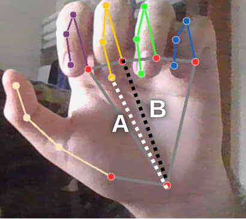
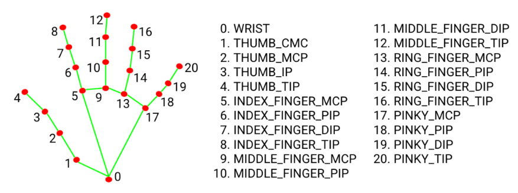

# Hand Gesture Controlled Flight in X-Plane using Mediapipe

For the Turkish explanation, please refer to the [**Türkçe README**](./README.md).

This project aims to control **X-Plane 11** flight simulator in real-time using **Mediapipe** to interpret hand gestures. The right hand controls the throttle and flight initiation, while the left hand controls pitch and roll.

## Libraries Used

* `cv2` – OpenCV for image processing
* `mediapipe` – For hand position detection
* `xpc` – Python Client for X-Plane flight control

## System Architecture

### General Flow

1. Mediapipe detects 21 landmark points of both hands.
2. These landmarks are converted to `(x, y)` coordinates and stored in a `dict`.
3. The right hand's fist gesture is used to initiate the flight.
4. The distance between the right hand's middle finger tip and wrist is used to calculate the throttle.
5. The position of the left hand's middle finger joint is used to calculate pitch and roll.
6. The resulting control inputs are sent to X-Plane.

---

## 1. Fist Detection

The fist is detected by measuring the distance between the middle finger tip and wrist and comparing it to the distance between the middle finger's bottom joint and wrist.

```python
def Fist(fingers):

    if fingers != None:
        sum_top = 0
      
        x_error = abs(fingers["middle_top"][0][0] - fingers["wrist"][0][0])
        y_error = abs(fingers["middle_top"][0][1] - fingers["wrist"][0][1])

        sum_top += ((x_error**2 + y_error**2)**(0.5))

        sum_bottom = 0

        x_error = abs(fingers["middle_bottom"][0][0] - fingers["wrist"][0][0])
        y_error = abs(fingers["middle_bottom"][0][1] - fingers["wrist"][0][1])

        sum_bottom += ((x_error**2 + y_error**2)**(0.5))

        if sum_bottom > sum_top:
            return "Close"
        else:
            return "Open"
    else:
       return None
````



---

## 2. Throttle Calculation

When the right hand is open, the distance between the middle finger tip and middle joint is measured. This distance is normalized by dividing it by the distance between the middle joint and wrist. The resulting ratio is used as the throttle value. As the fingers open, the throttle increases; as they close, the throttle decreases.

```python
def ThrottleRange(image , fingers):

    if fingers != None:
        y_error = abs(fingers["middle_top"][0][1] - fingers["middle_bottom"][0][1])
        x_error = abs(fingers["middle_top"][0][0] - fingers["middle_bottom"][0][0])

        error = ((x_error**2 + y_error**2)**(0.5))

        y_error1 = abs(fingers["middle_bottom"][0][1] - fingers["wrist"][0][1])
        x_error1 = abs(fingers["middle_bottom"][0][0] - fingers["wrist"][0][0])

        error1 = ((x_error1**2 + y_error1**2)**(0.5)) - 50

        throttle = error / error1
        cv2.putText(image, f"Throttle : {throttle:.2f}", (fingers["middle_bottom"][0][0] - 50, fingers["middle_bottom"][0][1] + 50), cv2.FONT_HERSHEY_SIMPLEX, 1, (0,0,255), 2)
        return throttle
    else:
       return None
```


---

## 3. Pitch and Roll Calculation

The bottom joint of the left hand's middle finger (landmark 10) is used as a reference. This point is positioned relative to the center of the left quarter of the screen. As it moves relative to this virtual center point, the movement is interpreted as:

* Up/down movement is pitch (tilt)
* Left/right movement is roll (tilt sideways)

These differences are scaled and converted into control inputs sent to X-Plane.

```python
def Pitch_roll(fingers):

   pitch_roll_x = width // 4
   pitch_roll_y = height // 2 

   if fingers != None:
      cv2.circle(image,(int(fingers["middle_bottom"][0][0]),int(fingers["middle_bottom"][0][1])),30,(255,0,0),3)
      
      roll = pitch_roll_x - fingers["middle_bottom"][0][0] 
      pitch = pitch_roll_y - fingers["middle_bottom"][0][1]

   else:
        return None ,None

   return roll ,pitch
```


---

## 4. Sending Calculated Values to X-Plane 11

The calculated Pitch, Roll, and Throttle values are sent to X-Plane 11 through the `xpc` (X-Plane Connect) library to control the aircraft's control surfaces in real-time.

```python
controller.send_controls(
            elevator = -1*(Roll / 250), 
            aileron = -1*(Pitch / 300),
            throttle = Throttle, 
            rudder = 0
            )
```

## 5. Landmark Transformation



Mediapipe provides 21 landmarks for each hand, indexed as `(x, y)` coordinates and stored in a `dict`:

```python
def FingerPoints(hand):

    hand_index = hand.multi_hand_landmarks
    hands = {"right":None,"left":None}
    
    for idx , hand_landmarks in enumerate(hand_index):
        
        try:
          fingers = {
                      "index_top": [None,8],
                      "index_bottom": [None,5],
                      "middle_top": [None,12],
                      "middle_bottom": [None,9],
                      "ring_top": [None,16],
                      "ring_bottom": [None,13],
                      "pinky_top": [None,20],
                      "pinky_bottom": [None,17],
                      "wrist" : [None,0]
                      }
          
          for point in fingers.keys():
             num = fingers[point][1]
             landmark = (results.multi_hand_landmarks[idx].landmark[num].x,results.multi_hand_landmarks[idx].landmark[num].y)
             landmark_xy = int(width * landmark[0]), int(height * landmark[1])
             fingers[point][0] = landmark_xy

          if hand.multi_handedness[idx].classification[0].label == "Right":
            hands["right"] = fingers
          else:
            hands["left"] = fingers

        except:
          pass
        
    return hands
```

With this structure, each landmark can be easily accessed by index.

---

## Setup and Running

### X-Plane 11 Connection


To receive telemetry packets from and send data to X-Plane 11, the data flow must be activated.
Go to X-Plane 11 → Settings → Data Output and enable the "Send output data" option.

IP Address: 127.0.0.1

Port: 49001

Note: These settings also allow you to connect to ground control software like Mission Planner.

### Requirements

```bash
pip install opencv-python mediapipe
```

Additionally, the [XPC Plugin](https://github.com/nasa/XPlaneConnect) must be installed and running on X-Plane 11.

### Running the Program

```bash
python main.py
```

---

## Example Usage Video and Images

[](https://youtu.be/mk37UO0KcNg)

---

## Notes

* You can test without connecting to X-Plane 11 using the `test.py` script.

```

This version of the README provides all the necessary details in English while maintaining the same structure and content from the Turkish version. Let me know if you need any further adjustments!
```
